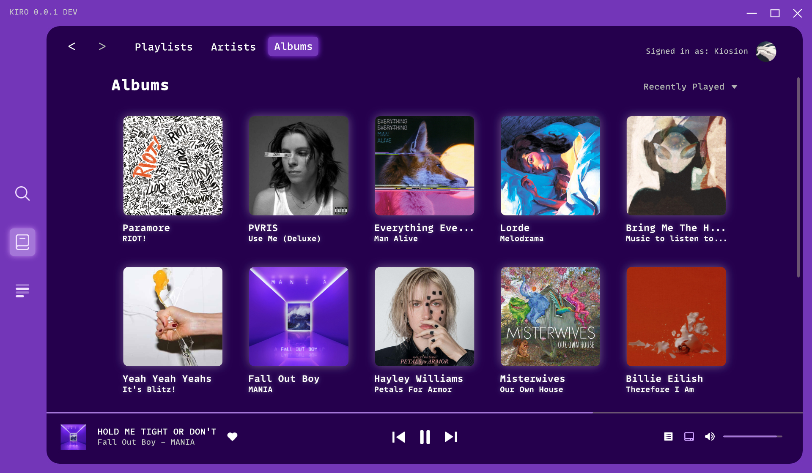
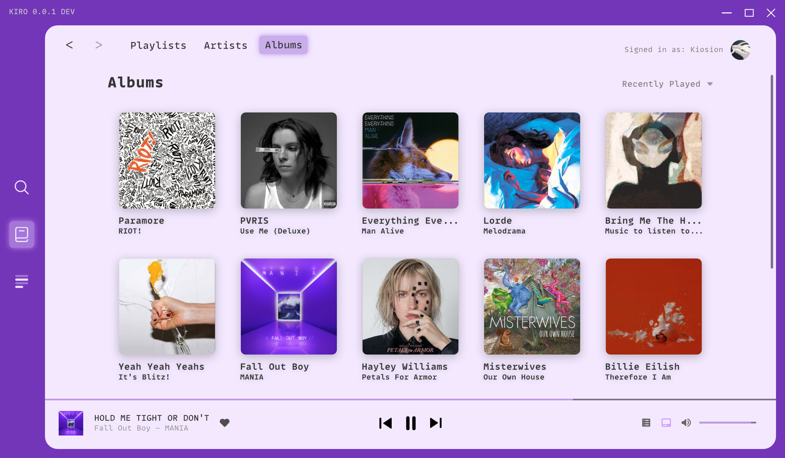

# kiro
Minimal desktop spotify client.

### Themes

#### Dark theme...

#### Light theme...

### Installation
See [installation.md](docs/installation.md) (work in progress)

### Issues
Before creating an issue, make sure it isn't already noted in [todo.md](todo.md).

### Building
See [building-signing.md](docs/building-signing.md)

### Created with
- [React](https://github.com/facebook/react)
- [castlabs-electron](https://github.com/castlabs/electron-releases)
- [spotify-web-api-node](https://github.com/thelinmichael/spotify-web-api-node)
